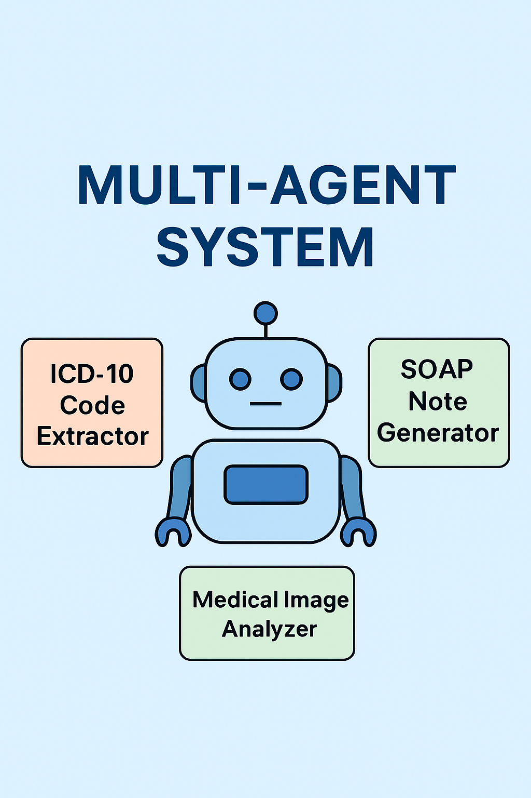
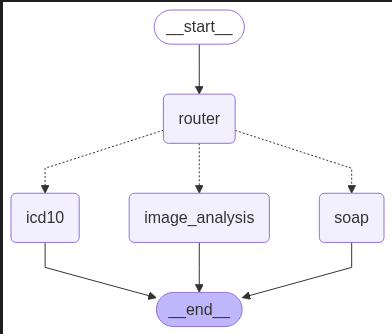
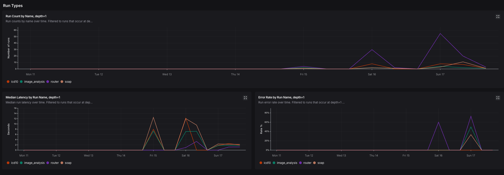

# 🏥 Multi-Agent Healthcare Assistant

This project is a modular FastAPI-based application designed to simulate a real-world clinical assistant powered by multiple AI agents. It supports clinical note analysis, medical image interpretation, and structured SOAP note generation — all powered by large language and vision models.


---

## 🚀 Features

- 🧠 **ICD-10 Code Extraction**  
  Extracts ICD-10 codes from free-text clinical notes using NLP models.

- 🖼️ **Medical Image Analysis**  
  Supports analysis of radiology images (X-ray, MRI, etc.) using multimodal models like MedGemma.

- 📋 **SOAP Note Generation**  
  Generates structured SOAP notes from raw clinical transcripts.

- 🧩 **Multi-Agent Architecture**  
  Built with modular agents for each task, easily extensible and integrated via `agentic_workflow.py`.

- 🔌 **FastAPI Backend**  
  Exposes an endpoint to upload both clinical text and medical images.

The user input goes through the router agent. The router agent analyzes the input, and routes the input to either icd10 code generation agent, soap generation agent or image analysis agent.

All the agents use MedGemma model as the LLM. The LLM is run locally via **Ollama**. In order to reduce the latency and memory usage, a quantized model is used. 


Here is an architecture diagram:



---

## 🎬 Demo

Watch a quick demo of the Multi-Agent Medical System in action:

[<video src="artifacts/demo.mp4" controls width="600"></video>
](https://github.com/user-attachments/assets/d5451b68-ee10-4f70-8876-39fdf3886654)


---

## 📊 Monitoring


The app is monitored using LangSmith (optional).



---
## 📝 Requirements

- **OS**: Windows, macOS, or Linux
- **RAM**: 8 GB minimum (the quantized 4B model uses ~3 GB)
- **Ollama**: Download from [https://ollama.com](https://ollama.com)
- **Python**: 3.11+

---

## ⚡ Quick Start

```bash
# 1. Install Ollama → https://ollama.com

# 2. Pull the model
ollama pull medgemma

# 3. Install Python deps
pip install -r requirements.txt

# 4. Run the app
uvicorn app.main:app --reload

# 5. Open in browser → http://localhost:8000
```

---

## 📦 Installation (Detailed)

### 1. Install Ollama

Download and install Ollama from [https://ollama.com](https://ollama.com).

After installation, pull the MedGemma model:
```bash
ollama pull medgemma
```

> **Note:** The model will be automatically downloaded (~2.5 GB) on first use if you skip this step.

### 2. Clone the repo

```bash
git clone https://github.com/rashedulalbab253/Multi-Agent-Healthcare-Assistant_using_Langraph.git

```

### 3. Setup Python environment
```bash
python -m venv venv

# Windows:
venv\Scripts\activate

# macOS/Linux:
# source venv/bin/activate

pip install --upgrade pip
pip install -r requirements.txt
```

### 4. Setup .env file (Optional — for LangSmith monitoring)
Create a `.env` file in the root directory:
```bash
LANGCHAIN_TRACING_V2="true"
LANGCHAIN_ENDPOINT="<your-langsmith-endpoint>"
LANGCHAIN_API_KEY="your-langsmith-api-key"
LANGCHAIN_PROJECT="your-langsmith-project"
```

> If you don't need LangSmith monitoring, you can skip this step. The app will work without it.

### 5. Start Ollama
Make sure Ollama is running before starting the app:
```bash
ollama serve
```

> On Windows, Ollama usually runs as a background service automatically after installation.

### 6. Run the app
```bash
uvicorn app.main:app --reload
```

Go to http://localhost:8000 and interact with the app.

---

## 🐳 Docker

Run everything with a single command using Docker Compose:

```bash
docker-compose up --build
```

This will:
1. Start the **Ollama** container and auto-pull the `medgemma` model
2. Start the **FastAPI** app container
3. Expose the app at **http://localhost:8000**

To stop:
```bash
docker-compose down
```

> **Note:** The first run will take a few minutes to download the model (~2.5 GB). The model is persisted in a Docker volume so subsequent starts are instant.

---

## 🔄 CI/CD — GitHub Actions

Every push to `main` automatically builds the Docker image and pushes it to Docker Hub.

**Image:** [`rashedulalbab1234/multi-agent-healthcare-assistant`](https://hub.docker.com/r/rashedulalbab1234/multi-agent-healthcare-assistant)

### Setup Required Secrets

Go to your GitHub repo → **Settings → Secrets and variables → Actions** and add:

| Secret Name | Value |
|---|---|
| `DOCKERHUB_USERNAME` | `rashedulalbab1234` |
| `DOCKERHUB_TOKEN` | Your Docker Hub access token |

> To create a Docker Hub access token, go to [Docker Hub → Account Settings → Security → New Access Token](https://hub.docker.com/settings/security).

### Pull the pre-built image

```bash
docker pull rashedulalbab1234/multi-agent-healthcare-assistant:latest
```

---

## 📄 License

This project is licensed under the MIT License - see the [LICENSE](LICENSE) file for details.
